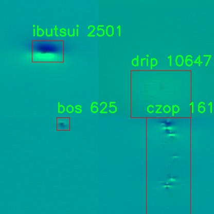

# 水面旋涡类型检测检测系统源码分享
 # [一条龙教学YOLOV8标注好的数据集一键训练_70+全套改进创新点发刊_Web前端展示]

### 1.研究背景与意义

项目参考[AAAI Association for the Advancement of Artificial Intelligence](https://gitee.com/qunmasj/projects)

项目来源[AACV Association for the Advancement of Computer Vision](https://kdocs.cn/l/cszuIiCKVNis)

研究背景与意义

水面旋涡的形成与消散是水体动力学中的重要现象，其不仅影响水体的生态环境，还对航运、渔业及水资源管理等领域产生深远影响。随着全球气候变化和人类活动的加剧，水面旋涡的研究愈发显得重要。传统的水面旋涡检测方法多依赖于人工观察和经验判断，效率低下且容易受到主观因素的影响。因此，基于计算机视觉和深度学习技术的自动化检测系统应运而生，成为研究水面旋涡的重要工具。

YOLO（You Only Look Once）系列模型因其高效的实时目标检测能力而广泛应用于各类视觉任务。YOLOv8作为该系列的最新版本，具备更高的检测精度和更快的处理速度，能够在复杂环境中快速识别和分类目标。针对水面旋涡的特征，YOLOv8的改进版本将通过优化网络结构和训练策略，提升其在水面旋涡类型检测中的表现。该研究旨在构建一个基于改进YOLOv8的水面旋涡类型检测系统，借助深度学习技术，实现对不同类型水面旋涡的高效识别与分类。

本研究所使用的数据集包含547幅图像，涵盖了7种不同的旋涡类型，包括awa、bos、czop、drip、ibutsui、ibutsut和yogo。这些类别的多样性为模型的训练提供了丰富的样本，有助于提高模型的泛化能力和识别准确率。通过对这些旋涡类型的深入分析，可以揭示其形成机制及其对水体生态的影响，为后续的水体管理和保护提供科学依据。

在实际应用中，基于改进YOLOv8的水面旋涡检测系统不仅可以用于科研领域的水体监测，还能够为水利工程、环境保护和灾害预警等提供技术支持。通过实时监测水面旋涡的变化，相关部门可以及时采取措施，防止因旋涡引发的潜在危害。此外，该系统的推广应用也将推动计算机视觉技术在水文领域的深入发展，促进跨学科的研究合作。

综上所述，基于改进YOLOv8的水面旋涡类型检测系统的研究，不仅具有重要的理论意义，也具备广泛的应用前景。通过提升水面旋涡的检测效率和准确性，将为水体生态环境的保护和可持续管理提供强有力的技术支持，推动相关领域的科学研究与实践进步。

### 2.图片演示


##### 注意：由于此博客编辑较早，上面“2.图片演示”和“3.视频演示”展示的系统图片或者视频可能为老版本，新版本在老版本的基础上升级如下：（实际效果以升级的新版本为准）

  （1）适配了YOLOV8的“目标检测”模型和“实例分割”模型，通过加载相应的权重（.pt）文件即可自适应加载模型。

  （2）支持“图片识别”、“视频识别”、“摄像头实时识别”三种识别模式。

  （3）支持“图片识别”、“视频识别”、“摄像头实时识别”三种识别结果保存导出，解决手动导出（容易卡顿出现爆内存）存在的问题，识别完自动保存结果并导出到tempDir中。

  （4）支持Web前端系统中的标题、背景图等自定义修改，后面提供修改教程。

  另外本项目提供训练的数据集和训练教程,暂不提供权重文件（best.pt）,需要您按照教程进行训练后实现图片演示和Web前端界面演示的效果。

### 3.视频演示

[3.1 视频演示](https://www.bilibili.com/video/BV1CY4uexEtW/)

### 4.数据集信息展示

##### 4.1 本项目数据集详细数据（类别数＆类别名）

nc: 7
names: ['awa', 'bos', 'czop', 'drip', 'ibutsui', 'ibutsut', 'yogo']


##### 4.2 本项目数据集信息介绍

数据集信息展示

在现代计算机视觉领域，尤其是在物体检测和分类任务中，数据集的质量和多样性对模型的性能至关重要。本研究中所使用的数据集名为“agc”，其主要目的是为了训练和改进YOLOv8模型，以实现对水面旋涡类型的高效检测。该数据集包含七个不同的类别，分别为：awa、bos、czop、drip、ibutsui、ibutsut和yogo。这些类别代表了水面旋涡的不同类型，涵盖了从简单的涡流到复杂的水流模式，具有广泛的应用潜力。

首先，数据集的构建考虑到了水面旋涡的多样性和复杂性。每个类别的样本都经过精心挑选，确保其在视觉特征上的代表性。比如，awa类别可能包含典型的水面波动图像，展现了涡流的基本形态；而bos类别则可能展示更为复杂的水流交互，体现了多种因素对水面形态的影响。czop类别则可能专注于特定的水面旋涡模式，这些模式在实际应用中可能与环境因素密切相关。

在数据集的构建过程中，图像的采集和标注是一个重要环节。为了确保每个类别的样本具有足够的多样性，数据集中的图像来自不同的环境和条件。这不仅包括不同的水体类型（如湖泊、河流和海洋），还涵盖了不同的天气和光照条件。这种多样性使得模型在训练过程中能够学习到更为丰富的特征，从而提高其在实际应用中的鲁棒性和准确性。

此外，数据集的标注过程采用了高标准的质量控制措施。每个图像都经过专业人员的仔细审查和标注，确保每个旋涡类型都能被准确识别。这种精确的标注不仅有助于提高模型的训练效果，也为后续的模型评估提供了可靠的基准。

在数据集的使用过程中，研究者们可以利用YOLOv8模型的先进特性，如其高效的特征提取能力和实时检测能力，来实现对水面旋涡的快速识别和分类。通过对“agc”数据集的训练，模型能够在多种复杂环境下准确地检测出不同类型的水面旋涡，为水文监测、环境保护以及水资源管理等领域提供重要的技术支持。

总之，“agc”数据集不仅为YOLOv8模型的训练提供了丰富的样本和高质量的标注，还为水面旋涡的研究提供了坚实的数据基础。随着模型的不断优化和改进，未来有望在实际应用中实现更高的检测精度和更广泛的应用场景。这一数据集的成功构建和应用，标志着水面旋涡检测技术向前迈出了重要的一步，为相关领域的研究和实践提供了新的可能性。





### 5.全套项目环境部署视频教程（零基础手把手教学）

[5.1 环境部署教程链接（零基础手把手教学）](https://www.ixigua.com/7404473917358506534?logTag=c807d0cbc21c0ef59de5)


[5.2 安装Python虚拟环境创建和依赖库安装视频教程链接（零基础手把手教学）](https://www.ixigua.com/7404474678003106304?logTag=1f1041108cd1f708b01a)

### 6.手把手YOLOV8训练视频教程（零基础小白有手就能学会）

[6.1 手把手YOLOV8训练视频教程（零基础小白有手就能学会）](https://www.ixigua.com/7404477157818401292?logTag=d31a2dfd1983c9668658)

### 7.70+种全套YOLOV8创新点代码加载调参视频教程（一键加载写好的改进模型的配置文件）

[7.1 70+种全套YOLOV8创新点代码加载调参视频教程（一键加载写好的改进模型的配置文件）](https://www.ixigua.com/7404478314661806627?logTag=29066f8288e3f4eea3a4)

### 8.70+种全套YOLOV8创新点原理讲解（非科班也可以轻松写刊发刊，V10版本正在科研待更新）

由于篇幅限制，每个创新点的具体原理讲解就不一一展开，具体见下列网址中的创新点对应子项目的技术原理博客网址【Blog】：


[8.1 70+种全套YOLOV8创新点原理讲解链接](https://gitee.com/qunmasj/good)

### 9.系统功能展示（检测对象为举例，实际内容以本项目数据集为准）

图9.1.系统支持检测结果表格显示

  图9.2.系统支持置信度和IOU阈值手动调节

  图9.3.系统支持自定义加载权重文件best.pt(需要你通过步骤5中训练获得)

  图9.4.系统支持摄像头实时识别

  图9.5.系统支持图片识别

  图9.6.系统支持视频识别

  图9.7.系统支持识别结果文件自动保存

  图9.8.系统支持Excel导出检测结果数据


### 10.原始YOLOV8算法原理

原始YOLOv8算法原理

YOLOv8算法是目标检测领域的一个重要里程碑，代表了Ultralytics公司在2023年推出的最新进展。作为YOLO系列的第八个版本，YOLOv8在其前身YOLOv5、YOLOv6和YOLOv7的基础上，进行了多项创新和优化，使其在检测精度和速度上都取得了显著提升。YOLOv8的设计理念强调快速、准确和易于使用，使其在广泛的应用场景中表现出色，包括目标检测、图像分割和图像分类等任务。

YOLOv8的网络结构主要由输入层、主干网络（Backbone）、特征融合层（Neck）和检测头（Head）四个部分组成。输入层负责对图像进行预处理，调整图像比例并实现数据增强。YOLOv8默认的输入图像尺寸为640x640，但为了适应不同长宽比的图像，采用了自适应缩放策略。该策略通过将长边按比例缩小到指定尺寸，然后对短边进行填充，从而减少信息冗余，提升检测和推理速度。此外，YOLOv8在训练过程中引入了Mosaic增强技术，通过将四张不同的图像随机缩放并拼接，生成新的训练样本，促使模型学习不同位置和周围像素的特征，进而提高预测精度。

在主干网络部分，YOLOv8借鉴了YOLOv7中的ELAN模块设计，将YOLOv5中的C3模块替换为C2F模块。C2F模块的设计通过引入更多的梯度流分支，在保持轻量化的同时，获得了更丰富的梯度信息，从而提高了检测精度。该模块的结构由多个卷积层和瓶颈结构组成，允许模型在深层网络中更好地传递梯度，缓解了梯度消失的问题。通过这种设计，YOLOv8能够在不同尺度的模型中灵活调整通道数，进一步提升特征提取的能力。

YOLOv8的Neck部分采用了PAN-FPN结构，这一结构结合了特征金字塔和路径聚合网络，增强了网络的特征融合能力。通过对不同层次的特征进行深度融合，YOLOv8能够更好地捕捉到多尺度目标的信息，从而提高检测性能。在Neck中，YOLOv8直接将Backbone不同阶段输出的特征进行上采样，而不再使用传统的1x1卷积连接层，这一改进减少了计算复杂度，同时保留了更多的特征信息。

YOLOv8的Head部分则是其最大的创新之一，采用了解耦头（Decoupled Head）结构。与YOLOv5的耦合头不同，YOLOv8将检测和分类的卷积分开，分别处理。这种解耦设计使得模型在进行类别预测和边界框回归时，能够更专注于各自的任务，提升了整体的检测效率。此外，YOLOv8抛弃了传统的Anchor-Based方法，转而采用Anchor-Free的思想，将目标检测转化为关键点检测。这一转变使得YOLOv8在处理不同尺寸和形状的目标时更加灵活，避免了预设Anchor带来的限制。

在损失函数的设计上，YOLOv8引入了Distribution Focal Loss（DFL）和CIoU Loss，旨在提高模型对目标的聚焦能力。DFL通过调整样本的权重，使得模型在训练过程中更加关注难以分类的样本，从而提升检测精度。CIoU Loss则在边界框回归中提供了更精确的反馈，帮助模型快速收敛到真实目标的位置。

总的来说，YOLOv8通过一系列创新的设计和优化，不仅在检测精度和速度上取得了显著提升，还在灵活性和易用性方面表现出色。其独特的网络结构和高效的训练策略，使得YOLOv8成为当前目标检测领域的一款强大工具，广泛应用于各种实际场景中。随着YOLOv8的推广和应用，目标检测技术的未来将更加光明，推动着计算机视觉领域的不断进步。


### 11.项目核心源码讲解（再也不用担心看不懂代码逻辑）

#### 11.1 ui.py

以下是对代码的核心部分进行保留和详细注释的版本：

```python
import sys
import subprocess

def run_script(script_path):
    """
    使用当前 Python 环境运行指定的脚本。

    Args:
        script_path (str): 要运行的脚本路径

    Returns:
        None
    """
    # 获取当前 Python 解释器的路径
    python_path = sys.executable

    # 构建运行命令，使用 streamlit 运行指定的脚本
    command = f'"{python_path}" -m streamlit run "{script_path}"'

    # 执行命令并等待其完成
    result = subprocess.run(command, shell=True)
    
    # 检查命令执行的返回码，0 表示成功，非0表示出错
    if result.returncode != 0:
        print("脚本运行出错。")

# 实例化并运行应用
if __name__ == "__main__":
    # 指定要运行的脚本路径
    script_path = "web.py"  # 假设 web.py 在当前目录下

    # 调用函数运行脚本
    run_script(script_path)
```

### 代码注释说明：

1. **导入模块**：
   - `sys`：用于访问与 Python 解释器紧密相关的变量和函数。
   - `subprocess`：用于执行外部命令和程序。

2. **`run_script` 函数**：
   - 该函数接收一个脚本路径作为参数，并在当前 Python 环境中运行该脚本。
   - 使用 `sys.executable` 获取当前 Python 解释器的路径，以确保脚本在正确的环境中运行。
   - 构建一个命令字符串，使用 `streamlit` 运行指定的脚本。
   - 使用 `subprocess.run` 执行命令，并等待其完成。
   - 检查返回码，如果返回码不为 0，则表示脚本运行出错，并打印错误信息。

3. **主程序块**：
   - 在 `__main__` 块中，指定要运行的脚本路径（这里假设 `web.py` 在当前目录下）。
   - 调用 `run_script` 函数来执行指定的脚本。

这个程序文件 `ui.py` 的主要功能是运行一个指定的 Python 脚本，具体来说是使用 Streamlit 框架来启动一个 Web 应用。程序的实现过程可以分为几个部分。

首先，文件导入了一些必要的模块，包括 `sys`、`os` 和 `subprocess`。`sys` 模块用于访问与 Python 解释器相关的变量和函数，`os` 模块提供了与操作系统交互的功能，而 `subprocess` 模块则用于创建新进程、连接到它们的输入/输出/错误管道，并获取它们的返回码。

接下来，程序定义了一个名为 `run_script` 的函数，该函数接受一个参数 `script_path`，表示要运行的脚本的路径。在函数内部，首先获取当前 Python 解释器的路径，这通过 `sys.executable` 实现。然后，构建一个命令字符串，该命令使用当前的 Python 解释器来运行指定的脚本，具体是通过 `streamlit run` 命令来启动 Web 应用。

随后，使用 `subprocess.run` 方法执行构建好的命令。如果命令执行的返回码不为零，表示脚本运行过程中出现了错误，程序会打印出“脚本运行出错”的提示信息。

最后，在文件的主程序部分，首先检查 `__name__` 是否为 `"__main__"`，这意味着该文件是作为主程序运行的。在这个条件下，程序指定了要运行的脚本路径，这里是通过调用 `abs_path("web.py")` 获取的，`abs_path` 函数的具体实现不在此文件中，但可以推测它用于获取 `web.py` 的绝对路径。最后，调用 `run_script` 函数来执行这个脚本。

总体而言，这个文件的功能是提供一个简单的接口来启动一个 Streamlit Web 应用，用户只需指定要运行的脚本路径，程序就会处理其余的细节。

#### 11.2 70+种YOLOv8算法改进源码大全和调试加载训练教程（非必要）\ultralytics\utils\plotting.py

以下是代码中最核心的部分，并附上详细的中文注释：

```python
class Colors:
    """
    Ultralytics 默认颜色调色板，提供了将十六进制颜色代码转换为 RGB 值的方法。
    """

    def __init__(self):
        """初始化颜色调色板，使用 matplotlib 的颜色值。"""
        # 定义一组十六进制颜色
        hexs = ('FF3838', 'FF9D97', 'FF701F', 'FFB21D', 'CFD231', '48F90A', '92CC17', '3DDB86', '1A9334', '00D4BB',
                '2C99A8', '00C2FF', '344593', '6473FF', '0018EC', '8438FF', '520085', 'CB38FF', 'FF95C8', 'FF37C7')
        # 将十六进制颜色转换为 RGB 并存储在调色板中
        self.palette = [self.hex2rgb(f'#{c}') for c in hexs]
        self.n = len(self.palette)  # 颜色数量
        # 定义特定的颜色调色板用于姿态估计
        self.pose_palette = np.array([[255, 128, 0], [255, 153, 51], [255, 178, 102], [230, 230, 0], [255, 153, 255],
                                      [153, 204, 255], [255, 102, 255], [255, 51, 255], [102, 178, 255], [51, 153, 255],
                                      [255, 153, 153], [255, 102, 102], [255, 51, 51], [153, 255, 153], [102, 255, 102],
                                      [51, 255, 51], [0, 255, 0], [0, 0, 255], [255, 0, 0], [255, 255, 255]],
                                     dtype=np.uint8)

    def __call__(self, i, bgr=False):
        """根据索引返回颜色，如果 bgr 为 True，则返回 BGR 格式的颜色。"""
        c = self.palette[int(i) % self.n]  # 获取颜色
        return (c[2], c[1], c[0]) if bgr else c  # 返回 BGR 或 RGB 格式

    @staticmethod
    def hex2rgb(h):
        """将十六进制颜色代码转换为 RGB 值。"""
        return tuple(int(h[1 + i:1 + i + 2], 16) for i in (0, 2, 4))  # 分别提取 R、G、B 值


class Annotator:
    """
    Ultralytics 注释器，用于训练/验证马赛克和 JPG 以及预测注释。
    """

    def __init__(self, im, line_width=None, font_size=None, font='Arial.ttf', pil=False, example='abc'):
        """初始化 Annotator 类，设置图像、线宽和颜色调色板。"""
        assert im.data.contiguous, '图像不连续。请对输入图像应用 np.ascontiguousarray(im)。'
        non_ascii = not is_ascii(example)  # 检查是否为非 ASCII 字符
        self.pil = pil or non_ascii  # 根据情况选择使用 PIL 或 cv2
        self.lw = line_width or max(round(sum(im.shape) / 2 * 0.003), 2)  # 计算线宽
        if self.pil:  # 使用 PIL
            self.im = im if isinstance(im, Image.Image) else Image.fromarray(im)  # 转换为 PIL 图像
            self.draw = ImageDraw.Draw(self.im)  # 创建绘图对象
            try:
                font = check_font('Arial.Unicode.ttf' if non_ascii else font)  # 检查字体
                size = font_size or max(round(sum(self.im.size) / 2 * 0.035), 12)  # 计算字体大小
                self.font = ImageFont.truetype(str(font), size)  # 加载字体
            except Exception:
                self.font = ImageFont.load_default()  # 加载默认字体
        else:  # 使用 cv2
            self.im = im
            self.tf = max(self.lw - 1, 1)  # 字体厚度
            self.sf = self.lw / 3  # 字体缩放

    def box_label(self, box, label='', color=(128, 128, 128), txt_color=(255, 255, 255)):
        """在图像上添加一个带标签的矩形框。"""
        if isinstance(box, torch.Tensor):
            box = box.tolist()  # 转换为列表
        if self.pil or not is_ascii(label):
            self.draw.rectangle(box, width=self.lw, outline=color)  # 绘制矩形框
            if label:
                w, h = self.font.getsize(label)  # 获取文本宽度和高度
                outside = box[1] - h >= 0  # 标签是否适合框外
                self.draw.rectangle(
                    (box[0], box[1] - h if outside else box[1], box[0] + w + 1,
                     box[1] + 1 if outside else box[1] + h + 1),
                    fill=color,
                )  # 绘制标签背景
                self.draw.text((box[0], box[1] - h if outside else box[1]), label, fill=txt_color, font=self.font)  # 绘制标签文本
        else:  # cv2
            p1, p2 = (int(box[0]), int(box[1])), (int(box[2]), int(box[3]))
            cv2.rectangle(self.im, p1, p2, color, thickness=self.lw, lineType=cv2.LINE_AA)  # 绘制矩形框
            if label:
                w, h = cv2.getTextSize(label, 0, fontScale=self.sf, thickness=self.tf)[0]  # 获取文本宽度和高度
                outside = p1[1] - h >= 3
                p2 = p1[0] + w, p1[1] - h - 3 if outside else p1[1] + h + 3
                cv2.rectangle(self.im, p1, p2, color, -1, cv2.LINE_AA)  # 绘制填充背景
                cv2.putText(self.im,
                            label, (p1[0], p1[1] - 2 if outside else p1[1] + h + 2),
                            0,
                            self.sf,
                            txt_color,
                            thickness=self.tf,
                            lineType=cv2.LINE_AA)  # 绘制标签文本

    def result(self):
        """返回带注释的图像作为数组。"""
        return np.asarray(self.im)  # 将 PIL 图像转换为 numpy 数组
```

以上代码实现了颜色调色板的定义和图像注释的功能。`Colors` 类用于管理颜色，而 `Annotator` 类用于在图像上绘制矩形框和文本标签。每个方法都附有详细的中文注释，便于理解其功能和用途。

这个程序文件是一个用于YOLOv8算法的可视化和绘图工具，主要用于处理图像标注、绘制训练结果和可视化模型输出等功能。文件中包含多个类和函数，下面是对其主要内容的说明。

首先，文件导入了一些必要的库，包括图像处理库（如OpenCV和PIL）、数据处理库（如NumPy和Pandas）、以及绘图库（如Matplotlib）。这些库为后续的图像处理和可视化提供了支持。

接下来，定义了一个`Colors`类，用于管理Ultralytics的默认颜色调色板。该类可以将十六进制颜色代码转换为RGB值，并提供了一个颜色列表和一些颜色相关的功能。这个类的实例在后续的绘图过程中会被频繁使用。

然后，定义了一个`Annotator`类，负责在图像上添加标注，包括绘制边框、文本、关键点和掩膜等。该类支持使用PIL或OpenCV进行绘图，具体取决于输入图像的类型。`Annotator`类的构造函数接收图像、线宽、字体等参数，并初始化相关属性。它提供了多个方法，例如`box_label`用于绘制边框和标签，`masks`用于绘制掩膜，`kpts`用于绘制关键点等。

文件中还定义了一些函数，如`plot_labels`、`save_one_box`、`plot_images`等。这些函数的功能包括绘制训练标签、保存图像裁剪、绘制图像网格等。其中，`plot_labels`函数用于绘制训练标签的统计信息，`save_one_box`函数用于根据给定的边界框从图像中裁剪出相应的部分并保存，`plot_images`函数则用于绘制带有标签的图像网格。

此外，还有`plot_results`和`plot_tune_results`函数，用于绘制训练结果和超参数调优结果的可视化图。这些函数通过读取CSV文件中的数据，生成相应的图表并保存到指定目录。

最后，文件中还包含一些辅助函数，如`output_to_target`用于将模型输出转换为目标格式，`feature_visualization`用于可视化模型的特征图等。

总体而言，这个程序文件提供了一整套用于YOLOv8模型训练和推理结果可视化的工具，方便用户对模型的性能进行分析和评估。

#### 11.3 code\ultralytics\utils\instance.py

以下是经过简化和注释的核心代码部分，主要集中在 `Bboxes` 和 `Instances` 类的实现上。

```python
import numpy as np

class Bboxes:
    """
    处理边界框的类，支持多种格式（'xyxy', 'xywh', 'ltwh'）。
    属性:
        bboxes (numpy.ndarray): 存储边界框的二维数组。
        format (str): 边界框的格式（'xyxy', 'xywh', 或 'ltwh'）。
    """

    def __init__(self, bboxes, format="xyxy") -> None:
        """初始化 Bboxes 类，指定边界框数据和格式。"""
        assert format in ["xyxy", "xywh", "ltwh"], f"无效的边界框格式: {format}"
        bboxes = bboxes[None, :] if bboxes.ndim == 1 else bboxes  # 确保 bboxes 是二维数组
        assert bboxes.ndim == 2 and bboxes.shape[1] == 4, "边界框必须是二维数组，且每个框包含4个值"
        self.bboxes = bboxes
        self.format = format

    def convert(self, format):
        """将边界框格式转换为指定类型。"""
        assert format in ["xyxy", "xywh", "ltwh"], f"无效的边界框格式: {format}"
        if self.format == format:
            return  # 如果格式相同，则不需要转换
        # 根据当前格式和目标格式选择转换函数
        func = self._get_conversion_function(format)
        self.bboxes = func(self.bboxes)  # 执行转换
        self.format = format  # 更新格式

    def _get_conversion_function(self, format):
        """根据当前格式返回相应的转换函数。"""
        if self.format == "xyxy":
            return xyxy2xywh if format == "xywh" else xyxy2ltwh
        elif self.format == "xywh":
            return xywh2xyxy if format == "xyxy" else xywh2ltwh
        else:
            return ltwh2xyxy if format == "xyxy" else ltwh2xywh

    def areas(self):
        """返回每个边界框的面积。"""
        self.convert("xyxy")  # 确保使用 xyxy 格式计算面积
        return (self.bboxes[:, 2] - self.bboxes[:, 0]) * (self.bboxes[:, 3] - self.bboxes[:, 1])  # 计算面积

    def __len__(self):
        """返回边界框的数量。"""
        return len(self.bboxes)

class Instances:
    """
    存储图像中检测到的对象的边界框、分段和关键点的容器。
    属性:
        _bboxes (Bboxes): 处理边界框操作的内部对象。
        keypoints (ndarray): 关键点数组，形状为 [N, 17, 3]。
        segments (ndarray): 分段数组，形状为 [N, 1000, 2]。
    """

    def __init__(self, bboxes, segments=None, keypoints=None, bbox_format="xywh", normalized=True) -> None:
        """初始化 Instances 类，指定边界框、分段和关键点。"""
        self._bboxes = Bboxes(bboxes=bboxes, format=bbox_format)  # 创建 Bboxes 对象
        self.keypoints = keypoints
        self.normalized = normalized
        self.segments = segments

    def convert_bbox(self, format):
        """转换边界框格式。"""
        self._bboxes.convert(format=format)

    @property
    def bbox_areas(self):
        """计算边界框的面积。"""
        return self._bboxes.areas()

    def scale(self, scale_w, scale_h, bbox_only=False):
        """按比例缩放边界框、分段和关键点。"""
        self._bboxes.mul(scale=(scale_w, scale_h, scale_w, scale_h))  # 缩放边界框
        if not bbox_only:  # 如果不是仅缩放边界框，则缩放分段和关键点
            self.segments[..., 0] *= scale_w
            self.segments[..., 1] *= scale_h
            if self.keypoints is not None:
                self.keypoints[..., 0] *= scale_w
                self.keypoints[..., 1] *= scale_h

    def __len__(self):
        """返回实例的数量。"""
        return len(self._bboxes)

    @classmethod
    def concatenate(cls, instances_list: List["Instances"], axis=0) -> "Instances":
        """
        将多个 Instances 对象合并为一个。
        """
        assert isinstance(instances_list, (list, tuple))
        if not instances_list:
            return cls(np.empty(0))  # 返回空实例
        assert all(isinstance(instance, Instances) for instance in instances_list)

        # 合并边界框、分段和关键点
        cat_boxes = np.concatenate([ins._bboxes.bboxes for ins in instances_list], axis=axis)
        cat_segments = np.concatenate([ins.segments for ins in instances_list], axis=axis)
        cat_keypoints = np.concatenate([ins.keypoints for ins in instances_list], axis=axis) if instances_list[0].keypoints is not None else None
        
        return cls(cat_boxes, cat_segments, cat_keypoints, bbox_format=instances_list[0]._bboxes.format, normalized=instances_list[0].normalized)

    @property
    def bboxes(self):
        """返回边界框。"""
        return self._bboxes.bboxes
```

### 代码注释说明：
1. **Bboxes 类**：负责处理边界框的创建、格式转换和面积计算。
   - `__init__` 方法初始化边界框数据和格式。
   - `convert` 方法用于转换边界框格式。
   - `areas` 方法计算每个边界框的面积。

2. **Instances 类**：用于存储和处理图像中检测到的对象的边界框、分段和关键点。
   - `__init__` 方法初始化实例，包含边界框、分段和关键点。
   - `scale` 方法按比例缩放边界框和相关数据。
   - `concatenate` 方法合并多个实例对象。

这些类和方法为处理图像中的边界框提供了基础功能，支持多种格式和操作。

这个程序文件是一个用于处理边界框（bounding boxes）的类库，主要用于计算机视觉任务，特别是在目标检测中。文件中定义了两个主要的类：`Bboxes`和`Instances`，它们分别用于管理边界框和包含边界框、分割和关键点的实例。

首先，`Bboxes`类用于处理不同格式的边界框，包括`xyxy`（左上角和右下角坐标）、`xywh`（中心坐标和宽高）以及`ltwh`（左上角坐标和宽高）。在初始化时，`Bboxes`类会验证输入的格式和维度，确保边界框数据是一个二维的NumPy数组，并且每个边界框包含四个值。该类提供了多种方法来转换边界框格式、计算面积、缩放和偏移边界框等。

在`Bboxes`类中，`convert`方法可以将边界框从一种格式转换为另一种格式。`areas`方法计算每个边界框的面积。类中还定义了`mul`和`add`方法，用于按比例缩放和添加偏移量。`__len__`方法返回边界框的数量，`concatenate`类方法可以将多个`Bboxes`对象合并为一个。

接下来，`Instances`类是一个更复杂的容器，除了包含边界框外，还可以存储分割和关键点信息。它的初始化方法接受边界框、分割和关键点数据，并将边界框数据封装在`Bboxes`对象中。`Instances`类提供了类似的转换和操作方法，例如`convert_bbox`、`scale`、`denormalize`和`normalize`，用于处理边界框和其他数据的坐标变换。

`Instances`类还实现了翻转、裁剪和去除零面积框等功能。通过`__getitem__`方法，可以根据索引获取特定的实例或一组实例。`concatenate`类方法可以将多个`Instances`对象合并成一个，确保所有对象的属性一致。

总的来说，这个文件提供了一套完整的工具，用于管理和操作边界框及其相关数据，适用于目标检测和其他计算机视觉任务。

#### 11.4 70+种YOLOv8算法改进源码大全和调试加载训练教程（非必要）\ultralytics\models\utils\loss.py

以下是代码中最核心的部分，并附上详细的中文注释：

```python
import torch
import torch.nn as nn
import torch.nn.functional as F
from ultralytics.utils.loss import FocalLoss, VarifocalLoss
from ultralytics.utils.metrics import bbox_iou
from .ops import HungarianMatcher

class DETRLoss(nn.Module):
    """
    DETR (DEtection TRansformer) 损失类。该类计算并返回DETR目标检测模型的不同损失组件。
    计算分类损失、边界框损失、GIoU损失，并可选择性地计算辅助损失。
    """

    def __init__(self, nc=80, loss_gain=None, aux_loss=True, use_fl=True, use_vfl=False, use_uni_match=False, uni_match_ind=0):
        """
        初始化DETR损失函数。

        参数:
            nc (int): 类别数量。
            loss_gain (dict): 各损失组件的系数。
            aux_loss (bool): 是否计算辅助损失。
            use_fl (bool): 是否使用FocalLoss。
            use_vfl (bool): 是否使用VarifocalLoss。
            use_uni_match (bool): 是否使用固定层为辅助分支分配标签。
            uni_match_ind (int): 固定层的索引。
        """
        super().__init__()

        # 设置损失增益系数
        if loss_gain is None:
            loss_gain = {'class': 1, 'bbox': 5, 'giou': 2, 'no_object': 0.1, 'mask': 1, 'dice': 1}
        self.nc = nc  # 类别数量
        self.matcher = HungarianMatcher(cost_gain={'class': 2, 'bbox': 5, 'giou': 2})  # 匹配器
        self.loss_gain = loss_gain  # 损失增益
        self.aux_loss = aux_loss  # 是否使用辅助损失
        self.fl = FocalLoss() if use_fl else None  # Focal Loss对象
        self.vfl = VarifocalLoss() if use_vfl else None  # Varifocal Loss对象

        self.use_uni_match = use_uni_match  # 是否使用统一匹配
        self.uni_match_ind = uni_match_ind  # 统一匹配的索引
        self.device = None  # 设备

    def _get_loss_class(self, pred_scores, targets, gt_scores, num_gts, postfix=''):
        """计算分类损失。"""
        name_class = f'loss_class{postfix}'  # 分类损失名称
        bs, nq = pred_scores.shape[:2]  # 获取批次大小和查询数量
        one_hot = torch.zeros((bs, nq, self.nc + 1), dtype=torch.int64, device=targets.device)  # 初始化one-hot编码
        one_hot.scatter_(2, targets.unsqueeze(-1), 1)  # 将目标值转换为one-hot编码
        one_hot = one_hot[..., :-1]  # 去掉最后一类（背景类）
        gt_scores = gt_scores.view(bs, nq, 1) * one_hot  # 计算真实得分

        # 计算分类损失
        if self.fl:
            if num_gts and self.vfl:
                loss_cls = self.vfl(pred_scores, gt_scores, one_hot)  # 使用VarifocalLoss
            else:
                loss_cls = self.fl(pred_scores, one_hot.float())  # 使用FocalLoss
            loss_cls /= max(num_gts, 1) / nq  # 归一化损失
        else:
            loss_cls = nn.BCEWithLogitsLoss(reduction='none')(pred_scores, gt_scores).mean(1).sum()  # 计算BCE损失

        return {name_class: loss_cls.squeeze() * self.loss_gain['class']}  # 返回分类损失

    def _get_loss_bbox(self, pred_bboxes, gt_bboxes, postfix=''):
        """计算边界框损失和GIoU损失。"""
        name_bbox = f'loss_bbox{postfix}'  # 边界框损失名称
        name_giou = f'loss_giou{postfix}'  # GIoU损失名称

        loss = {}
        if len(gt_bboxes) == 0:  # 如果没有真实边界框
            loss[name_bbox] = torch.tensor(0., device=self.device)
            loss[name_giou] = torch.tensor(0., device=self.device)
            return loss

        # 计算L1损失和GIoU损失
        loss[name_bbox] = self.loss_gain['bbox'] * F.l1_loss(pred_bboxes, gt_bboxes, reduction='sum') / len(gt_bboxes)
        loss[name_giou] = 1.0 - bbox_iou(pred_bboxes, gt_bboxes, xywh=True, GIoU=True)
        loss[name_giou] = loss[name_giou].sum() / len(gt_bboxes)
        loss[name_giou] = self.loss_gain['giou'] * loss[name_giou]
        return {k: v.squeeze() for k, v in loss.items()}  # 返回损失

    def _get_loss(self, pred_bboxes, pred_scores, gt_bboxes, gt_cls, gt_groups, masks=None, gt_mask=None, postfix='', match_indices=None):
        """获取损失。"""
        if match_indices is None:
            match_indices = self.matcher(pred_bboxes, pred_scores, gt_bboxes, gt_cls, gt_groups, masks=masks, gt_mask=gt_mask)

        idx, gt_idx = self._get_index(match_indices)  # 获取匹配索引
        pred_bboxes, gt_bboxes = pred_bboxes[idx], gt_bboxes[gt_idx]  # 根据索引获取预测和真实边界框

        bs, nq = pred_scores.shape[:2]  # 获取批次大小和查询数量
        targets = torch.full((bs, nq), self.nc, device=pred_scores.device, dtype=gt_cls.dtype)  # 初始化目标
        targets[idx] = gt_cls[gt_idx]  # 更新目标

        gt_scores = torch.zeros([bs, nq], device=pred_scores.device)  # 初始化真实得分
        if len(gt_bboxes):
            gt_scores[idx] = bbox_iou(pred_bboxes.detach(), gt_bboxes, xywh=True).squeeze(-1)  # 计算IOU

        loss = {}
        loss.update(self._get_loss_class(pred_scores, targets, gt_scores, len(gt_bboxes), postfix))  # 计算分类损失
        loss.update(self._get_loss_bbox(pred_bboxes, gt_bboxes, postfix))  # 计算边界框损失
        return loss  # 返回总损失

    def forward(self, pred_bboxes, pred_scores, batch, postfix='', **kwargs):
        """
        前向传播，计算损失。

        参数:
            pred_bboxes (torch.Tensor): 预测的边界框。
            pred_scores (torch.Tensor): 预测的得分。
            batch (dict): 包含真实标签的字典。
            postfix (str): 损失名称的后缀。
        """
        self.device = pred_bboxes.device  # 设置设备
        match_indices = kwargs.get('match_indices', None)  # 获取匹配索引
        gt_cls, gt_bboxes, gt_groups = batch['cls'], batch['bboxes'], batch['gt_groups']  # 获取真实标签

        total_loss = self._get_loss(pred_bboxes[-1], pred_scores[-1], gt_bboxes, gt_cls, gt_groups, postfix=postfix, match_indices=match_indices)  # 计算总损失

        if self.aux_loss:  # 如果使用辅助损失
            total_loss.update(self._get_loss_aux(pred_bboxes[:-1], pred_scores[:-1], gt_bboxes, gt_cls, gt_groups, match_indices, postfix))  # 计算辅助损失

        return total_loss  # 返回总损失
```

### 代码核心部分说明：
1. **类定义**：`DETRLoss`类用于计算DETR模型的损失，包括分类损失、边界框损失和GIoU损失。
2. **初始化方法**：设置损失增益、类别数量、匹配器等。
3. **损失计算方法**：
   - `_get_loss_class`：计算分类损失。
   - `_get_loss_bbox`：计算边界框损失和GIoU损失。
   - `_get_loss`：整合分类损失和边界框损失。
4. **前向传播**：`forward`方法用于接收预测结果和真实标签，计算并返回总损失。

这段代码的核心在于损失的计算和匹配机制，确保模型在训练过程中能够有效地学习到目标检测的相关特征。

这个程序文件定义了一个用于目标检测模型的损失计算类，主要是基于DETR（DEtection TRansformer）模型的损失计算。该类主要用于计算不同的损失组件，包括分类损失、边界框损失、广义交并比（GIoU）损失，以及可选的辅助损失。

在初始化方法中，类接受多个参数，包括类别数量、损失增益系数、是否计算辅助损失、是否使用Focal Loss和Varifocal Loss等。若未提供损失增益系数，则使用默认值。类中还定义了一个匈牙利匹配器（HungarianMatcher），用于计算匹配成本和索引。

该类的核心方法包括：

1. **_get_loss_class**：计算分类损失。根据预测的分数、目标值和真实分数计算分类损失，支持使用Focal Loss或Varifocal Loss。

2. **_get_loss_bbox**：计算边界框损失和GIoU损失。根据预测的边界框和真实边界框计算L1损失和GIoU损失。

3. **_get_loss_aux**：计算辅助损失，适用于多层解码器的情况。该方法会遍历每一层的预测结果，并计算损失。

4. **_get_loss**：综合计算分类损失和边界框损失。首先通过匹配索引将预测的边界框与真实边界框进行匹配，然后计算损失。

5. **forward**：这是类的前向传播方法，接收预测的边界框和分数，以及批次数据，计算总损失。如果启用了辅助损失，还会计算辅助损失。

此外，文件中还定义了一个`RTDETRDetectionLoss`类，继承自`DETRLoss`，用于计算RT-DETR模型的检测损失。该类在计算损失时，还可以处理去噪声的元数据，以计算去噪声训练损失。

总的来说，这个文件提供了一个灵活且功能强大的损失计算框架，适用于不同的目标检测任务，能够支持多种损失函数和匹配策略。

#### 11.5 train.py

以下是经过简化和注释的核心代码部分，主要保留了训练检测模型的功能，并添加了详细的中文注释：

```python
import random
import numpy as np
import torch.nn as nn
from ultralytics.data import build_dataloader, build_yolo_dataset
from ultralytics.engine.trainer import BaseTrainer
from ultralytics.models import yolo
from ultralytics.nn.tasks import DetectionModel
from ultralytics.utils import LOGGER, RANK
from ultralytics.utils.torch_utils import de_parallel, torch_distributed_zero_first

class DetectionTrainer(BaseTrainer):
    """
    扩展自 BaseTrainer 类，用于基于检测模型的训练。
    """

    def build_dataset(self, img_path, mode="train", batch=None):
        """
        构建 YOLO 数据集。

        参数:
            img_path (str): 包含图像的文件夹路径。
            mode (str): 模式，`train` 或 `val`，用户可以为每种模式自定义不同的增强。
            batch (int, optional): 批次大小，适用于 `rect` 模式。默认为 None。
        """
        gs = max(int(de_parallel(self.model).stride.max() if self.model else 0), 32)
        return build_yolo_dataset(self.args, img_path, batch, self.data, mode=mode, rect=mode == "val", stride=gs)

    def get_dataloader(self, dataset_path, batch_size=16, rank=0, mode="train"):
        """构造并返回数据加载器。"""
        assert mode in ["train", "val"]
        with torch_distributed_zero_first(rank):  # 仅在 DDP 中初始化数据集 *.cache 一次
            dataset = self.build_dataset(dataset_path, mode, batch_size)
        shuffle = mode == "train"  # 训练模式下打乱数据
        workers = self.args.workers if mode == "train" else self.args.workers * 2
        return build_dataloader(dataset, batch_size, workers, shuffle, rank)  # 返回数据加载器

    def preprocess_batch(self, batch):
        """对一批图像进行预处理，包括缩放和转换为浮点数。"""
        batch["img"] = batch["img"].to(self.device, non_blocking=True).float() / 255  # 将图像转换为浮点数并归一化
        if self.args.multi_scale:  # 如果启用多尺度
            imgs = batch["img"]
            sz = (
                random.randrange(self.args.imgsz * 0.5, self.args.imgsz * 1.5 + self.stride)
                // self.stride
                * self.stride
            )  # 随机选择尺寸
            sf = sz / max(imgs.shape[2:])  # 计算缩放因子
            if sf != 1:
                ns = [
                    math.ceil(x * sf / self.stride) * self.stride for x in imgs.shape[2:]
                ]  # 计算新的形状
                imgs = nn.functional.interpolate(imgs, size=ns, mode="bilinear", align_corners=False)  # 进行插值
            batch["img"] = imgs
        return batch

    def set_model_attributes(self):
        """设置模型的属性，包括类别数量和名称。"""
        self.model.nc = self.data["nc"]  # 将类别数量附加到模型
        self.model.names = self.data["names"]  # 将类别名称附加到模型
        self.model.args = self.args  # 将超参数附加到模型

    def get_model(self, cfg=None, weights=None, verbose=True):
        """返回 YOLO 检测模型。"""
        model = DetectionModel(cfg, nc=self.data["nc"], verbose=verbose and RANK == -1)
        if weights:
            model.load(weights)  # 加载权重
        return model

    def plot_training_samples(self, batch, ni):
        """绘制带有注释的训练样本。"""
        plot_images(
            images=batch["img"],
            batch_idx=batch["batch_idx"],
            cls=batch["cls"].squeeze(-1),
            bboxes=batch["bboxes"],
            paths=batch["im_file"],
            fname=self.save_dir / f"train_batch{ni}.jpg",
            on_plot=self.on_plot,
        )
```

### 代码说明：
1. **类 `DetectionTrainer`**：继承自 `BaseTrainer`，用于训练检测模型。
2. **`build_dataset` 方法**：根据给定的图像路径和模式构建 YOLO 数据集。
3. **`get_dataloader` 方法**：构造数据加载器，支持分布式训练。
4. **`preprocess_batch` 方法**：对输入的图像批次进行预处理，包括归一化和多尺度调整。
5. **`set_model_attributes` 方法**：设置模型的类别数量和名称等属性。
6. **`get_model` 方法**：返回一个 YOLO 检测模型实例，并可选择加载预训练权重。
7. **`plot_training_samples` 方法**：绘制训练样本及其注释，便于可视化训练过程。

这个程序文件 `train.py` 是一个用于训练 YOLO（You Only Look Once）目标检测模型的实现，继承自 `BaseTrainer` 类。程序中包含了多个方法，用于构建数据集、获取数据加载器、预处理图像批次、设置模型属性、获取模型、验证模型、记录损失、输出训练进度、绘制训练样本和绘制训练指标等。

首先，`DetectionTrainer` 类通过 `build_dataset` 方法构建 YOLO 数据集。该方法接收图像路径、模式（训练或验证）和批次大小作为参数，并根据模型的步幅（stride）来调整数据集的构建。

接着，`get_dataloader` 方法用于构建并返回数据加载器。它会根据模式判断是否需要打乱数据，并设置工作线程的数量。通过 `torch_distributed_zero_first` 函数确保在分布式训练中只初始化一次数据集。

在处理图像批次时，`preprocess_batch` 方法会将图像缩放并转换为浮点数格式。如果启用了多尺度训练，它会随机选择一个尺寸，并根据该尺寸调整图像的大小。

`set_model_attributes` 方法用于设置模型的属性，包括类别数量和类别名称等，以便模型能够正确处理数据。

`get_model` 方法返回一个 YOLO 检测模型实例，并可选择加载预训练权重。

`get_validator` 方法返回一个用于模型验证的 `DetectionValidator` 实例，记录损失名称以便后续分析。

`label_loss_items` 方法用于返回带有标签的训练损失字典，方便后续的损失记录和分析。

`progress_string` 方法返回一个格式化的字符串，显示训练进度，包括当前的 epoch、GPU 内存使用情况、损失值、实例数量和图像大小等信息。

`plot_training_samples` 方法用于绘制训练样本及其标注，帮助可视化训练过程中的样本。

最后，`plot_metrics` 和 `plot_training_labels` 方法分别用于绘制训练指标和创建带标签的训练图，以便于分析模型的训练效果。

整体来看，这个文件提供了一个完整的训练流程，涵盖了数据准备、模型训练、验证和结果可视化等多个方面，适用于使用 YOLO 模型进行目标检测任务。

#### 11.6 code\ultralytics\data\annotator.py

以下是代码中最核心的部分，并附上详细的中文注释：

```python
from pathlib import Path
from ultralytics import SAM, YOLO

def auto_annotate(data, det_model="yolov8x.pt", sam_model="sam_b.pt", device="", output_dir=None):
    """
    自动为图像添加注释，使用YOLO目标检测模型和SAM分割模型。

    参数:
        data (str): 包含待注释图像的文件夹路径。
        det_model (str, optional): 预训练的YOLO检测模型，默认为'yolov8x.pt'。
        sam_model (str, optional): 预训练的SAM分割模型，默认为'sam_b.pt'。
        device (str, optional): 运行模型的设备，默认为空字符串（CPU或可用的GPU）。
        output_dir (str | None | optional): 保存注释结果的目录。
            默认为与'data'相同目录下的'labels'文件夹。

    示例:
        auto_annotate(data='ultralytics/assets', det_model='yolov8n.pt', sam_model='mobile_sam.pt')
    """
    # 加载YOLO目标检测模型
    det_model = YOLO(det_model)
    # 加载SAM分割模型
    sam_model = SAM(sam_model)

    # 将数据路径转换为Path对象
    data = Path(data)
    # 如果未指定输出目录，则创建一个默认的输出目录
    if not output_dir:
        output_dir = data.parent / f"{data.stem}_auto_annotate_labels"
    # 创建输出目录（如果不存在）
    Path(output_dir).mkdir(exist_ok=True, parents=True)

    # 使用YOLO模型对数据进行检测，stream=True表示流式处理
    det_results = det_model(data, stream=True, device=device)

    # 遍历检测结果
    for result in det_results:
        # 获取检测到的类别ID
        class_ids = result.boxes.cls.int().tolist()  # noqa
        # 如果检测到的类别ID不为空
        if len(class_ids):
            # 获取边界框坐标
            boxes = result.boxes.xyxy  # 边界框输出对象
            # 使用SAM模型进行分割，传入边界框
            sam_results = sam_model(result.orig_img, bboxes=boxes, verbose=False, save=False, device=device)
            # 获取分割结果
            segments = sam_results[0].masks.xyn  # noqa

            # 将分割结果写入文本文件
            with open(f"{Path(output_dir) / Path(result.path).stem}.txt", "w") as f:
                for i in range(len(segments)):
                    s = segments[i]
                    # 如果分割结果为空，则跳过
                    if len(s) == 0:
                        continue
                    # 将分割结果转换为字符串并写入文件
                    segment = map(str, segments[i].reshape(-1).tolist())
                    f.write(f"{class_ids[i]} " + " ".join(segment) + "\n")
```

### 代码核心部分解释：
1. **模型加载**：首先加载YOLO和SAM模型，准备进行目标检测和图像分割。
2. **路径处理**：使用`Path`对象处理输入数据路径和输出目录，确保输出目录存在。
3. **目标检测**：使用YOLO模型对输入数据进行目标检测，获取检测结果。
4. **分割处理**：对于每个检测结果，提取边界框并使用SAM模型进行图像分割。
5. **结果保存**：将分割结果和对应的类别ID写入文本文件，便于后续使用。

这段代码的核心功能是自动为图像中的目标生成注释，结合了目标检测和图像分割技术。

这个程序文件的主要功能是自动为图像进行标注，使用了YOLO（You Only Look Once）目标检测模型和SAM（Segment Anything Model）分割模型。它定义了一个名为`auto_annotate`的函数，该函数接收多个参数以配置标注过程。

首先，函数的参数包括：
- `data`：指定包含待标注图像的文件夹路径。
- `det_model`：预训练的YOLO检测模型，默认为'yolov8x.pt'。
- `sam_model`：预训练的SAM分割模型，默认为'sam_b.pt'。
- `device`：运行模型的设备，可以是CPU或GPU，默认为空字符串。
- `output_dir`：保存标注结果的目录，默认为与`data`相同目录下的'labels'文件夹。

函数内部首先加载YOLO和SAM模型。接着，使用`Path`模块处理输入的图像路径。如果没有指定输出目录，程序会自动创建一个以输入数据文件夹名称命名的输出目录。

然后，程序使用YOLO模型对输入图像进行目标检测，返回检测结果。对于每个检测结果，程序提取出目标的类别ID和边界框信息。如果检测到目标，程序会将这些边界框传递给SAM模型进行分割处理，得到分割结果。

最后，程序将每个图像的分割结果写入一个文本文件中，文件名与原图像相同，后缀为`.txt`。每一行包含类别ID和对应的分割坐标，坐标经过处理后以字符串形式写入文件。

整体而言，这段代码实现了一个自动化的图像标注流程，结合了目标检测和图像分割技术，方便用户快速生成标注数据。

### 12.系统整体结构（节选）

### 整体功能和构架概括

该项目主要围绕YOLOv8目标检测模型的训练、推理和可视化展开，结合了图像标注、损失计算、数据处理和模型评估等多个功能模块。整体架构可以分为以下几个部分：

1. **模型训练**：通过`train.py`文件实现YOLOv8模型的训练，支持数据集构建、损失计算和训练过程的可视化。
2. **损失计算**：`loss.py`文件定义了损失计算的逻辑，包括分类损失、边界框损失和辅助损失等。
3. **数据处理**：`annotator.py`文件实现了自动图像标注的功能，结合YOLO和SAM模型进行目标检测和分割。
4. **可视化工具**：`plotting.py`文件提供了可视化训练结果和数据标注的工具，帮助用户理解模型性能。
5. **实例管理**：`instance.py`文件提供了边界框和实例的管理功能，支持多种格式的边界框操作。
6. **模型推理**：其他文件如`predict.py`和`val.py`实现了模型的推理和验证功能，支持对输入图像进行预测和评估。

### 文件功能整理表

| 文件路径                                                                                         | 功能描述                                                         |
|--------------------------------------------------------------------------------------------------|------------------------------------------------------------------|
| `C:\shangjia\code\ui.py`                                                                        | 启动Streamlit Web应用，提供用户界面以运行YOLOv8模型。            |
| `C:\shangjia\code\70+种YOLOv8算法改进源码大全和调试加载训练教程（非必要）\ultralytics\utils\plotting.py` | 提供可视化工具，用于绘制训练结果、标注和图像网格等。              |
| `C:\shangjia\code\code\ultralytics\utils\instance.py`                                          | 管理和操作边界框及实例数据，支持多种格式的边界框处理。          |
| `C:\shangjia\code\70+种YOLOv8算法改进源码大全和调试加载训练教程（非必要）\ultralytics\models\utils\loss.py` | 计算目标检测模型的损失，包括分类损失和边界框损失等。            |
| `C:\shangjia\code\train.py`                                                                     | 训练YOLOv8模型，处理数据集、计算损失和可视化训练过程。          |
| `C:\shangjia\code\ultralytics\data\annotator.py`                                               | 自动为图像进行标注，结合YOLO和SAM模型进行目标检测和分割。       |
| `C:\shangjia\code\70+种YOLOv8算法改进源码大全和调试加载训练教程（非必要）\ultralytics\models\yolo\__init__.py` | 初始化YOLO模型模块，提供模型的构建和配置功能。                   |
| `C:\shangjia\code\ultralytics\models\sam\model.py`                                             | 定义SAM（Segment Anything Model）模型的结构和功能。              |
| `C:\shangjia\code\ultralytics\models\yolo\obb\val.py`                                          | 验证YOLO模型的性能，评估模型在验证集上的表现。                   |
| `C:\shangjia\code\ultralytics\utils\autobatch.py`                                              | 实现自动批处理功能，优化数据加载和处理效率。                     |
| `C:\shangjia\code\ultralytics\models\yolo\segment\predict.py`                                   | 实现YOLO模型的推理功能，处理输入图像并返回预测结果。            |
| `C:\shangjia\code\ultralytics\utils\callbacks\tensorboard.py`                                   | 集成TensorBoard回调功能，用于记录和可视化训练过程中的指标。      |

这个表格概述了每个文件的主要功能，帮助理解整个项目的结构和各个模块之间的关系。

注意：由于此博客编辑较早，上面“11.项目核心源码讲解（再也不用担心看不懂代码逻辑）”中部分代码可能会优化升级，仅供参考学习，完整“训练源码”、“Web前端界面”和“70+种创新点源码”以“13.完整训练+Web前端界面+70+种创新点源码、数据集获取”的内容为准。

### 13.完整训练+Web前端界面+70+种创新点源码、数据集获取


# [下载链接：https://mbd.pub/o/bread/ZpyUl5pu](https://mbd.pub/o/bread/ZpyUl5pu)